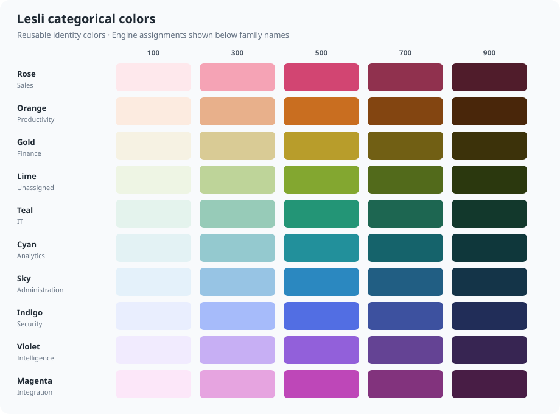

<div align="center">
    <h1 align="center">
        
    </h1>
    <h3>Shared Sass utilities and color tokens for Lesli applications.</h3>
</div>

<br />

<div align="center">
    <a target="_blank" href="https://github.com/LesliTech/lesli-css/actions/workflows/lesli-spec.yaml">
        
    </a>
    <a target="_blank" href="https://www.npmjs.com/package/lesli-css">
        
    </a>
    <a target="_blank" href="https://codecov.io/gh/LesliTech/lesli-css">
        
    </a>
    <a target="_blank" href="https://sonarcloud.io/project/overview?id=LesliTech_lesli-css">
        
    </a>
</div>

<br />

## Introduction

Lesli CSS is the shared styling foundation for Lesli products. It provides reusable Sass functions, mixins, layout helpers, and a centralized color system for applications built with Sass, Bulma, plain CSS, or Tailwind CSS.

The Sass color maps are the source of truth. During the package build they are also exported as CSS custom properties, allowing Sass and CSS-based tools to use exactly the same palette without copying color values between projects.

<br />

## Features

- A shared primary and semantic color system
- Reusable categorical palettes and decoupled engine identity aliases
- Portable CSS custom properties generated from the Sass maps
- Tailwind CSS v4-compatible design tokens
- Bulma-compatible Sass functions
- Responsive breakpoint helpers
- Typography, flexbox, shadow, container, and scrollbar mixins
- Sass modules using the modern `@use` API

<br />

## Installation

### Requirements

- Node.js and npm
- Sass when compiling Sass source; the compatible version is installed with this package

Install the package with npm:

```shell
npm install lesli-css
```

<br />

## Quick Start

Import the library as a Sass module:

```scss
@use "lesli-css" as lesli;

.button {
    background-color: lesli.lesli-color(primary, 500);
    color: lesli.lesli-color(neutral, 50);
}

.notification {
    background-color: lesli.lesli-color(success, 100);
    color: lesli.lesli-color(success, 800);
}
```

The default variant is `500`, so these declarations are equivalent:

```scss
color: lesli.lesli-color(success);
color: lesli.lesli-color(success, 500);
```

<br />

## Color System

The Lesli color system separates brand, semantic state, foundation, reusable categories, and product identity:

```text
Lesli Color System
├── Brand
│   └── Primary
├── Semantic
│   ├── Info
│   ├── Success
│   ├── Warning
│   └── Danger
├── Foundation
│   └── Neutral
├── Categorical
│   ├── Rose, Orange, Gold, Lime, Teal
│   └── Cyan, Sky, Indigo, Violet, Magenta
└── Engines
    └── Stable product identities mapped to categorical families
```

| Layer | Palette | Variants | Purpose |
| --- | --- | --- | --- |
| Brand | `primary` | 50–900 | Lesli brand and primary actions |
| Foundation | `neutral` | 50–900 | Text, borders, surfaces, and disabled states |
| Semantic | `info` | 50–900 | Informational messages and states |
| Semantic | `success` | 50–900 | Successful actions and positive states |
| Semantic | `warning` | 50–900 | Warnings and actions that need attention |
| Semantic | `danger` | 50–900 | Errors and destructive actions |
| Foundation | `black` | 50–900 | Neutral dark tones |

### Categorical colors

Categorical colors are reusable, non-semantic colors for categories, datasets, charts, calendars, avatars, tabs, modules, and other product areas. They do not communicate success, warning, danger, or information. Each family has five intentional roles: `100` for subtle backgrounds, `300` for soft accents, `500` for identity, `700` for strong accents, and `900` for dark surfaces and foregrounds.



| Family | 100 | 300 | 500 | 700 | 900 |
| --- | --- | --- | --- | --- | --- |
| Rose | `#FEE8EC` | `#F5A3B5` | `#D24572` | `#90314E` | `#501C2B` |
| Orange | `#FCEBE0` | `#E8B08B` | `#C96E20` | `#834511` | `#49260A` |
| Gold | `#F6F2E3` | `#D9CB95` | `#B89D2B` | `#715F14` | `#3C320A` |
| Lime | `#EEF5E4` | `#BED499` | `#83A730` | `#526A1B` | `#2B380E` |
| Teal | `#E4F3ED` | `#97CBB8` | `#239576` | `#1D6651` | `#12382C` |
| Cyan | `#E3F2F4` | `#94C9CF` | `#22909B` | `#15636B` | `#0F373B` |
| Sky | `#E4F1FA` | `#97C4E4` | `#2B88C0` | `#215E83` | `#143448` |
| Indigo | `#E9EEFE` | `#A6BBFA` | `#526EE3` | `#3D519F` | `#212D58` |
| Violet | `#F1EBFE` | `#C7AFF4` | `#9260DA` | `#644394` | `#372552` |
| Magenta | `#FCE7F9` | `#E6A4E0` | `#BE47B8` | `#82337D` | `#481D45` |

Use a categorical token when the color represents a reusable category rather than semantic state or a specific Lesli product:

```scss
.chart-series {
    color: lesli.lesli-color(categorical-sky, 500);
}
```

### Engine colors

Engine colors are product identity aliases. Each engine resolves to a categorical palette, so an assignment can change later without changing application markup or components.

| Engine | Categorical palette |
| --- | --- |
| `engine-administration` | `categorical-sky` |
| `engine-intelligence` | `categorical-violet` |
| `engine-productivity` | `categorical-orange` |
| `engine-integration` | `categorical-magenta` |
| `engine-analytics` | `categorical-cyan` |
| `engine-security` | `categorical-indigo` |
| `engine-finance` | `categorical-gold` |
| `engine-sales` | `categorical-rose` |
| `engine-it` | `categorical-teal` |

`categorical-lime` is intentionally unassigned and remains available for charts, datasets, calendars, modules, and future Engines.

Engine aliases expose the complete five-step scale. The default Sass variant remains `500`:

```scss
.administration-module {
    color: lesli.lesli-color(engine-administration);
}

.finance-module {
    background-color: lesli.lesli-color(engine-finance, 100);
    color: lesli.lesli-color(engine-finance, 700);
}
```

The palette assignment is an implementation and theme decision. Engine consumers should use `engine-*` tokens instead of depending directly on the assigned categorical family. Assignments can then change centrally without application code changes.

Categorical `500` values are identity colors, not automatic foreground/background pairs. In particular, do not assume white text is accessible on every `500`; use the appropriate existing foreground token or a darker categorical shade for solid surfaces.

### Legacy collection aliases

The previous family names, their `categorical-*` forms, and `collection` Engine aliases remain available with their historical values in a deprecated compatibility layer. They are not current categorical colors. New code should use the families listed above and `engine-*` identities:

```scss
// Deprecated compatibility APIs
color: lesli.lesli-color(cenote, 500);
color: lesli.lesli-color(categorical-cenote, 500);
color: lesli.lesli-color(collection, administration);
```

<br />

## CSS Custom Properties

Projects that do not compile Sass can import the generated color tokens:

```css
@import "lesli-css/css/colors.css";

.button {
    background-color: var(--lesli-color-primary-500);
    color: var(--lesli-color-neutral-50);
}

.notification {
    border-color: var(--lesli-color-warning-300);
}
```

The package generates variables for every palette entry, including:

```css
--lesli-color-primary-500: #276AD6;
--lesli-color-success-600: #1D704F;
--lesli-color-categorical-sky-300: #97C4E4;
--lesli-color-engine-finance-500: var(--lesli-color-categorical-gold-500);
```

Deprecated family variables retain their historical values, while aliases such as `--lesli-color-collection-finance` resolve to the current Engine identity.

> [!NOTE]
> Package imports in CSS must be processed by a bundler or CSS compiler that resolves dependencies from `node_modules`.

### Generate variables from Sass

The variable generator is also available as a mixin. This is useful when the variables must be emitted inside another selector or use a custom prefix:

```scss
@use "lesli-css" as lesli;

:root {
    @include lesli.lesli-color-variables();
}

.embedded-application {
    @include lesli.lesli-color-variables("--embedded-color");
}
```

<br />

## Tailwind CSS v4

Import the generated variables and map them to Tailwind theme tokens:

```css
@import "tailwindcss";
@import "lesli-css/css/colors.css";

@theme inline {
    --color-primary-50: var(--lesli-color-primary-50);
    --color-primary-500: var(--lesli-color-primary-500);
    --color-primary-600: var(--lesli-color-primary-600);
    --color-primary-900: var(--lesli-color-primary-900);
    --color-neutral-900: var(--lesli-color-neutral-900);

    --color-success-500: var(--lesli-color-success-500);
    --color-warning-500: var(--lesli-color-warning-500);
    --color-danger-500: var(--lesli-color-danger-500);

    --color-categorical-sky-300: var(--lesli-color-categorical-sky-300);
    --color-engine-finance: var(--lesli-color-engine-finance-500);
}
```

The mapped colors become standard Tailwind utilities:

```html
<button class="bg-primary-500 hover:bg-primary-600 text-white">
    Save changes
</button>

<p class="text-success-500">Changes saved successfully.</p>

<div class="border border-categorical-sky-300 bg-engine-finance text-neutral-900">
    Finance
</div>
```

Use a separate semantic variable when an application's brand color can change at runtime:

```css
:root {
    --application-color-brand: var(--lesli-color-primary-500);
}

@theme inline {
    --color-brand: var(--application-color-brand);
}
```

This keeps the Lesli palette stable while allowing an account or application to override `--application-color-brand`.

<br />

## Bulma

Use the shared colors when configuring Bulma's Sass variables:

```scss
@use "lesli-css" as lesli;

@use "bulma/sass" with (
    $primary: lesli.lesli-color(primary, 500),
    $info: lesli.lesli-color(info, 500),
    $success: lesli.lesli-color(success, 500),
    $warning: lesli.lesli-color(warning, 500),
    $danger: lesli.lesli-color(danger, 500)
);
```

<br />

## Sass Utilities

### Responsive breakpoints

```scss
@use "lesli-css" as lesli;

.navigation {
    display: none;

    @include lesli.lesli-breakpoint(tablet) {
        display: flex;
    }
}

.mobile-only {
    @include lesli.lesli-breakpoint-only-mobile() {
        display: block;
    }
}

.custom-range {
    @include lesli.lesli-breakpoint(600px, 900px) {
        padding: 2rem;
    }
}
```

### Typography and layout

```scss
@use "lesli-css" as lesli;

@include lesli.lesli-fonts-standard("Domine", "OpenSans");

.toolbar {
    @include lesli.lesli-flex(row, center, space-between);
    @include lesli.lesli-shadow();
}

.page-container {
    @include lesli.lesli-container();
}

.scrollable-panel {
    @include lesli.lesli-scrollbar(
        normal,
        lesli.lesli-color(neutral, 400),
        transparent
    );
}
```

<br />

## Package Structure

```text
lesli-css/
├── css/
│   └── colors.css             Generated portable color tokens
├── scss/
│   ├── colors/
│   │   ├── categorical.scss   Canonical reusable categorical palettes
│   │   ├── engines.scss       Canonical engine identity assignments
│   │   ├── collections.scss   Legacy compatibility aliases
│   │   └── ...                Color functions and generators
│   ├── components/            Reusable components
│   ├── elements/              Element styles
│   ├── helpers/               Breakpoints, fonts, flexbox, and shadows
│   ├── layout/                Containers, normalization, and scrollbars
│   └── vendor/                Bulma and Normalize integrations
├── _index.scss                Package Sass entry point
└── lesli.scss                 Public Sass module
```

<br />

## Development

Clone the repository and install its dependencies:

```shell
git clone https://github.com/LesliTech/lesli-css.git
cd lesli-css
npm install
```

Generate the distributable color tokens:

```shell
npm run build
```

Build the complete development CSS and color-token outputs:

```shell
make build.css
```

Run the Sass test suite:

```shell
npm test
```

The `prepack` script regenerates `css/colors.css` automatically before the package is packed or published.

<br />

## Documentation

- [Breakpoint mixins](./docs/mixin-breakpoint.md)
- [Lesli documentation](https://www.lesli.dev/)
- [Releases](https://github.com/LesliTech/lesli-css/releases)

<br />

## Community

- [X: @LesliTech](https://x.com/LesliTech)
- [hello@lesli.tech](mailto:hello@lesli.tech)
- [https://www.lesli.tech](https://www.lesli.tech)

<br />

## License

Copyright (c) 2026, Lesli Technologies, S. A.

This program is free software: you can redistribute it and/or modify
it under the terms of the GNU General Public License as published by
the Free Software Foundation, either version 3 of the License, or
at your option any later version.

This program is distributed in the hope that it will be useful,
but WITHOUT ANY WARRANTY; without even the implied warranty of
MERCHANTABILITY or FITNESS FOR A PARTICULAR PURPOSE. See the
GNU General Public License for more details.

You should have received a copy of the GNU General Public License
along with this program. If not, see [https://www.gnu.org/licenses/](https://www.gnu.org/licenses/).

The complete license text is available in the [license file](./license).

---

<br />
<br />

<div align="center">
    
    <h3 align="center">Shared styling foundations for the Lesli ecosystem.</h3>
</div>
